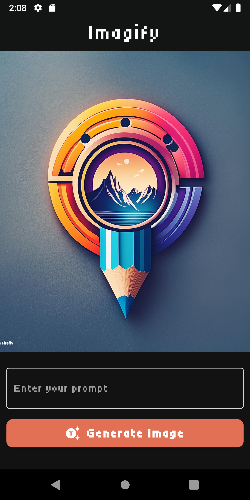
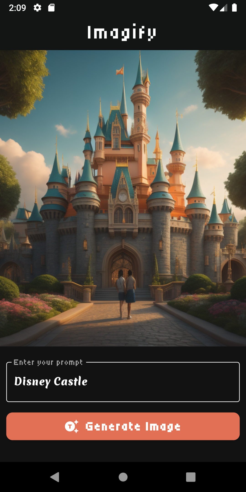

# Imagify - AI Image Generator

Imagify is an AI-powered image generator that allows users to create unique images by providing relevant prompts. This Flutter application leverages the Imagine API for backend processing.

## Features

- Generate images using AI by providing text prompts.
- User-friendly interface for entering prompts and viewing generated images.
- High-quality image generation powered by the Imagine API.

## Table of Contents

- [Prerequisites](#prerequisites)
- [Installation](#installation)
- [Usage](#usage)
- [Contributing](#contributing)
- [License](#license)
- [Contact](#contact)

## Prerequisites

Before you begin, ensure you have met the following requirements:

- Flutter SDK: [Flutter installation guide](https://flutter.dev/docs/get-started/install)
- Dart SDK: Comes bundled with Flutter, but ensure it's updated.
- Android Studio or Visual Studio Code: For IDE and device emulation.
- Imagine API Key: Sign up and get your API key from [Imagine API](https://imagineapi.com).

## Installation

1. **Clone the repository:**

   ```bash
   git clone https://github.com/yourusername/imagify.git
   cd imagify
   ```
2. **Install dependencies:**

  ```bash
  flutter pub get
  ```
3. **Set up the Imagine API key:**
  Create a .env file in the root of your project and add your API key:

  ```bash
  IMAGINE_API_KEY=your_api_key_here
  ```
4. **Run the application:**
Ensure you have an emulator running or a physical device connected, then run:

  ```bash
  flutter run
  ```

## Usage

1. Open the Imagify application on your device or emulator.
2. Enter a text prompt in the input field.
3. Press the "Generate" button.
4. Wait for the AI to generate an image based on your prompt.
5. View and save the generated image.

## Screenshots

Here are some screenshots of the application:

<p align="center">
  
  
</p>


## Contributing

Contributions are welcome! Follow these steps to contribute:

1. Fork the repository.
2. Create a new branch (`git checkout -b feature-branch`).
3. Make your changes.
4. Commit your changes (`git commit -m 'Add some feature'`).
5. Push to the branch (`git push origin feature-branch`).
6. Open a Pull Request.

Please ensure your pull request adheres to the following guidelines:

- Describe your changes in detail.
- Ensure your changes do not break existing functionality.
- Update documentation as needed.

## License

This project is licensed under the MIT License - see the [LICENSE](LICENSE) file for details.

## Contact

If you have any questions or need further assistance, feel free to reach out:

- **Dushyant Sharma**: [dushyantsharma1203@gmail.com](mailto:dushyantsharma1203@gmail.com)
- **GitHub**: [dushyant-sharma937](https://github.com/dushyant-sharma937)

Thank you for using Imagify! Happy generating!
